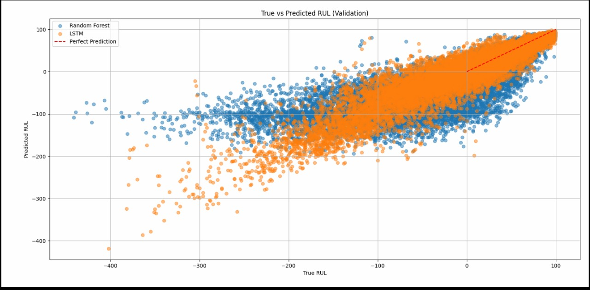
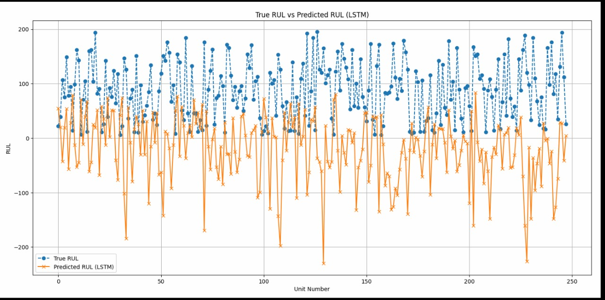

# Remaining Useful Life Prediction for Turbofan Engines

##  Problem Statement
The project aims to predict the **Remaining Useful Life (RUL)** of turbofan engines using multivariate time series data. Each time series corresponds to a different engine with unknown initial wear and manufacturing variations. Engines operate normally at the start of each series and develop faults over time. The goal is to estimate the number of cycles remaining before failure in the test set.

---

##  Dataset
- **Dataset Used**: FD004  
  - **Training trajectories**: 248  
  - **Test trajectories**: 249  
  - **Conditions**: Six operational conditions  
  - **Fault Modes**: Two (HPC Degradation, Fan Degradation)  
- **Data Format**: Each row in the dataset has 26 columns:
  - `unit number`, `time in cycles`, 3 operational settings, and 21 sensor measurements.

---

##  Workflow
1. **Data Preprocessing**
   - Load FD004 dataset.
   - Normalize and prepare features for modeling.
2. **Modeling**
   - Train two models:
     - **Random Forest Regressor**
     - **LSTM Neural Network**
3. **Prediction & Evaluation**
   - Predict RUL on test set.
   - Visualize predicted vs. true RUL.
   - Compute RMSE for model performance.

---

##  Why These Models?
- **Random Forest Regressor**:
  - Handles high-dimensional sensor data.
  - Models complex, non-linear relationships.
  - Reduces overfitting through ensemble learning.
- **LSTM (Long Short-Term Memory)**:
  - Designed for sequential data like time series.
  - Captures long-term dependencies in sensor readings.
  - Learns subtle patterns indicating impending engine failure.

---

##  Results & Visualizations

**Graph 1**: Scatter plot comparing true RUL vs. predicted RUL for Random Forest & LSTM  

**Graph 2**: Detailed visualization of true vs. predicted RUL for LSTM  

**Observations**:
- Points close to the diagonal line indicate accurate predictions.
- LSTM predictions were generally closer to the ideal line compared to Random Forest predictions.

**RMSE**: 37.59228 on the test set with the LSTM model.  
**Epochs**: 50 for LSTM training.

---

##  Contributors
- M. Viswajith (230003040)  
- Mayank Bhadra (230003043)  
- Pranshu Devlia (230003052)

---

##  Conclusion
- Both models could predict RUL with varying degrees of accuracy.
- **LSTM outperformed Random Forest**, achieving lower RMSE and better alignment with true RUL.
